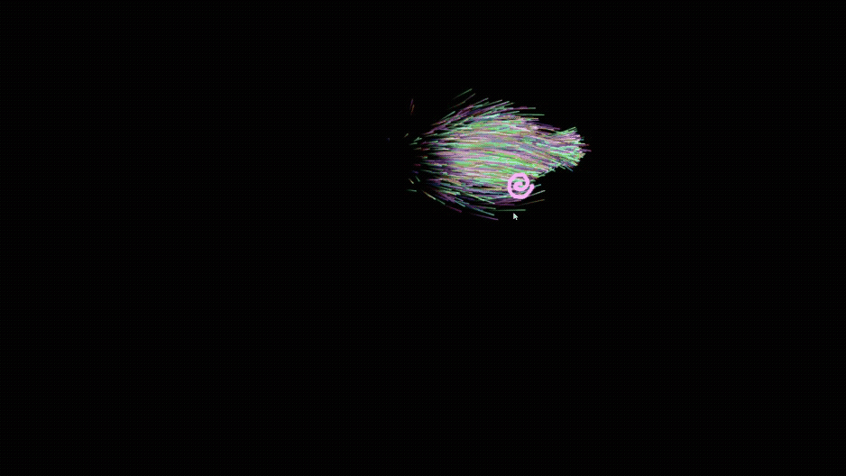

# [**Try the demo here**][particle-demo-url]

# Particles Using Rust and WebAssembly

Thank you to the [Rust and WebAssembly Working Group](https://github.com/rustwasm/team) for creating tools like [wasm-bindgen](https://github.com/rustwasm/wasm-bindgen), [wasm-pack](https://github.com/rustwasm/wasm-pack), and their many helpful usage examples.

[particle-demo-url]: <https://austinclem1.github.io/demos/particles/index.html>
